# NEDS: Neural Encoding and Decoding at Scale - Architecture Documentation

## Overview

NEDS is a revolutionary multimodal transformer-based model that simultaneously handles neural signals (spike data + LFP) and behavioral data for both encoding and decoding tasks using a novel multi-task masking strategy.

## Table of Contents
- [Model Architecture](#model-architecture)
- [Data Flow Pipeline](#data-flow-pipeline)
- [Multi-Task Masking Strategy](#multi-task-masking-strategy)
- [Session Stitching](#session-stitching)
- [Training Modes](#training-modes)
- [Data Specifications](#data-specifications)
- [Key Innovations](#key-innovations)

---

## Model Architecture

### Core Components Overview

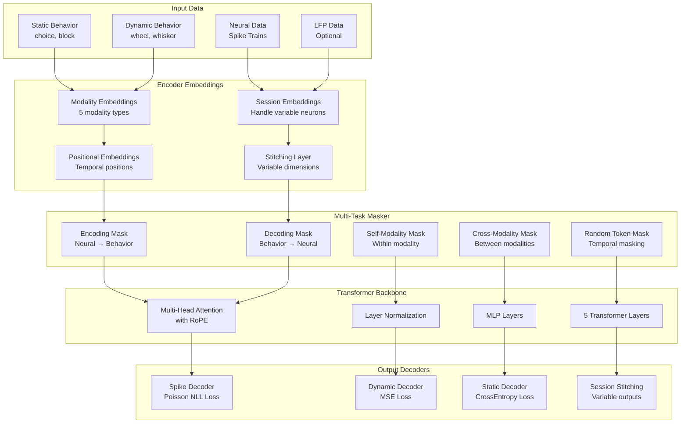

### Detailed Architecture Diagram

```
🧠 NEURAL DATA                    📊 SESSION EMBEDDINGS              🎭 MIXED MASKING                   🔍 MULTI-HEAD ATTENTION            ⚡ SPIKE PREDICTION
• Spike trains (20ms bins)    →   • Handle 100-800 neurons       →   • Random scheme selection      →   • 8 attention heads            →   • Poisson distribution
• LFP features (optional)         • Session-specific parameters      • Batch-wise variation             • Flash attention optimized        • Count data modeling
• Variable neurons per session                                                                                                               
                                       ↓                                     ↓                                     ↓                              ↓
🐭 BEHAVIORAL DATA                🔄 MODALITY EMBEDDINGS              → ENCODING: Mask behavior          📏 LAYER NORMALIZATION             🎯 BEHAVIOR PREDICTION
• Static: choice, block       →   • 5 modality types             →   ← DECODING: Mask neural       →   • ScaleNorm option             →   • MSE for continuous
• Dynamic: wheel, whisker         • Cross-modal attention            ↻ SELF: Within modality           • Gradient stabilization           • CrossEntropy for discrete
• Continuous signals                                                 ↔ CROSS: Between modality                                             
                                       ↓                                     ↓                                     ↓                              ↓
                                  📍 POSITION EMBEDDINGS              TEMPORAL MASKING                   � MLP LAYERS                       🧩 SESSION STITCHING
                                  • Temporal sequences                • Consecutive time bins            • GELU activation                   • Variable output dimensions
                                  • RoPE encoding                     • 30% masking ratio               • 512 intermediate dim              • Session-specific decoders
                                                                                                              ↓
                                                                                                         📚 5-LAYER STACK
                                                                                                         • Residual connections
                                                                                                         • 256 hidden dimensions
```

**Notion-Compatible Flow Chart:**

```
INPUT LAYER:
├── 🧠 Neural Data (Spikes + LFP)
└── 🐭 Behavioral Data (Static + Dynamic)
    ↓
EMBEDDING LAYER:
├── 📊 Session Embeddings (Handle variable neurons)
├── 🔄 Modality Embeddings (5 types)
└── 📍 Position Embeddings (RoPE)
    ↓
MASKING STRATEGY:
├── 🎭 Mixed Masking (Random selection)
├── → Encoding (Mask behavior)
├── ← Decoding (Mask neural)
├── ↻ Self-Modality (Within modality)
└── ↔ Cross-Modality (Between modalities)
    ↓
TRANSFORMER CORE:
├── 🔍 Multi-Head Attention (8 heads, Flash optimized)
├── 📏 Layer Normalization (ScaleNorm option)
├── 🔢 MLP Layers (GELU, 512 dim)
└── 📚 5-Layer Stack (Residual, 256 hidden)
    ↓
OUTPUT LAYER:
├── ⚡ Spike Prediction (Poisson NLL)
├── 🎯 Behavior Prediction (MSE/CrossEntropy)
└── 🧩 Session Stitching (Variable dimensions)
```

---

## Data Flow Pipeline

### Complete Data Processing Pipeline

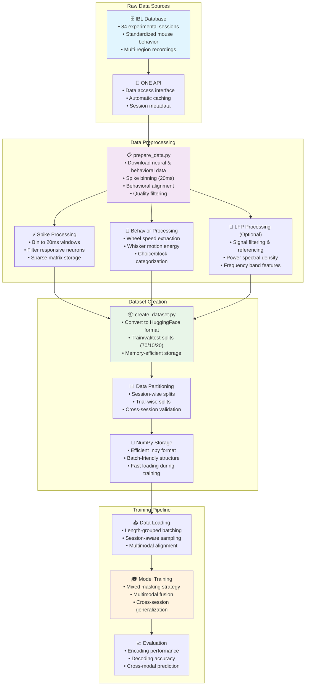

### Data Transformation Flow

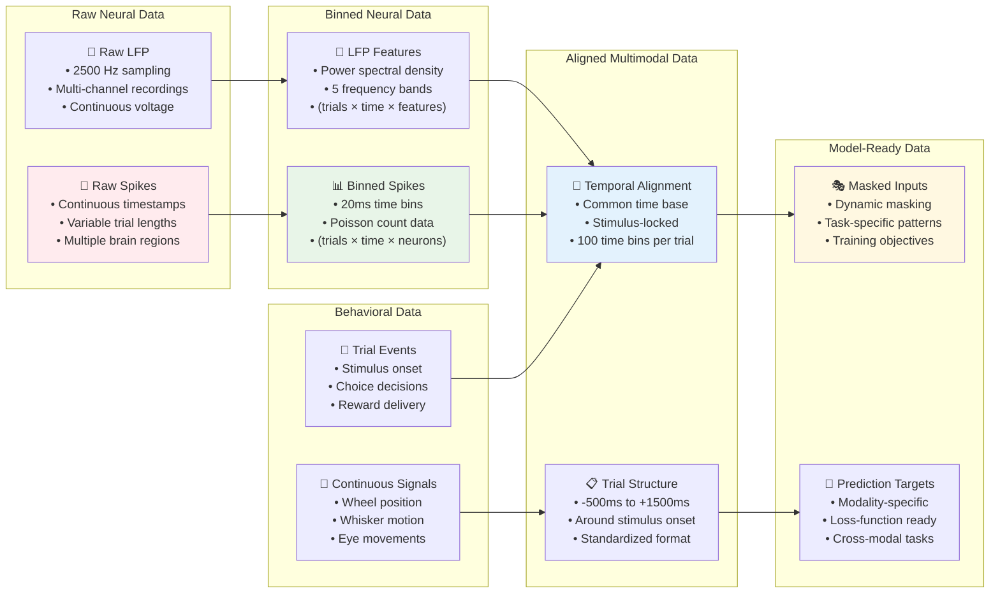

---

## Multi-Task Masking Strategy

### Masking Scheme Overview

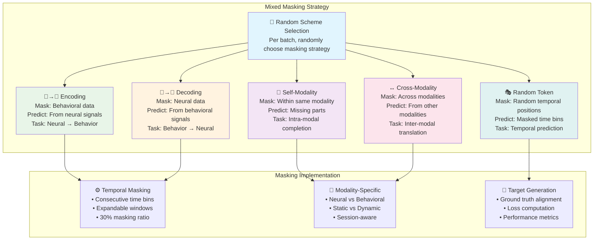

### Task-Specific Masking Patterns

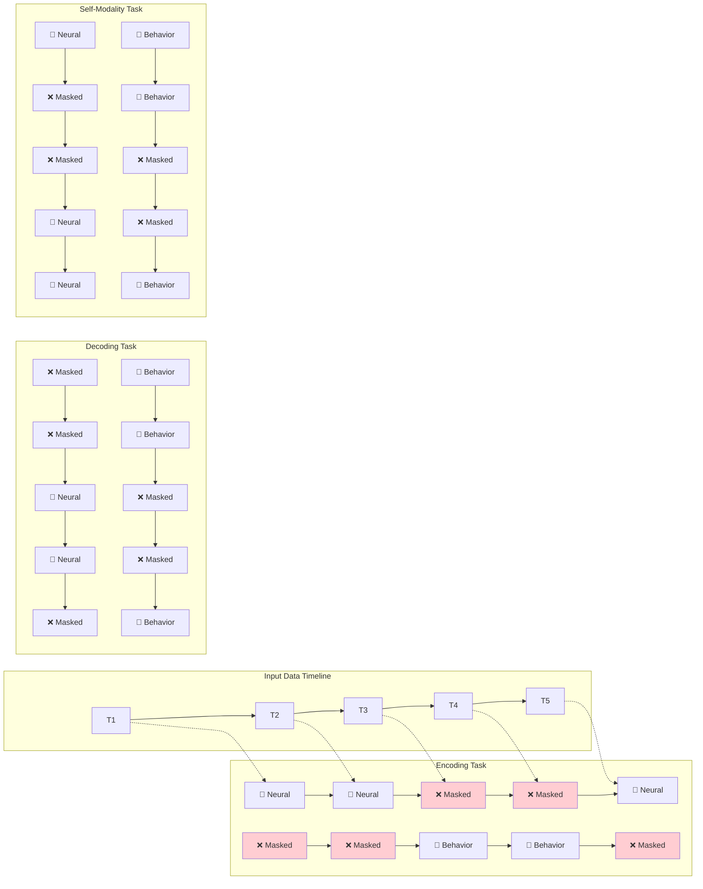

---

## Session Stitching

### Variable Neuron Count Handling

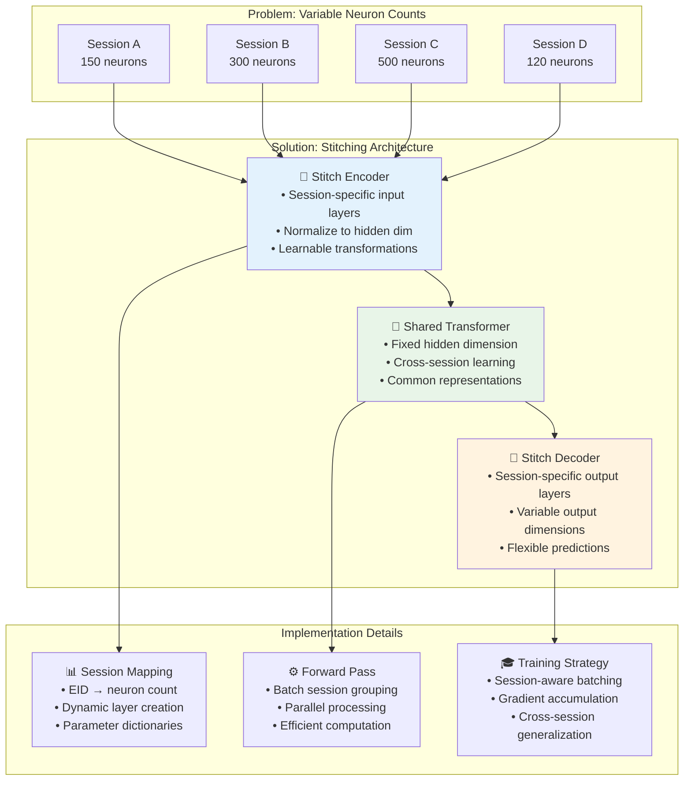

### Stitching Implementation Flow

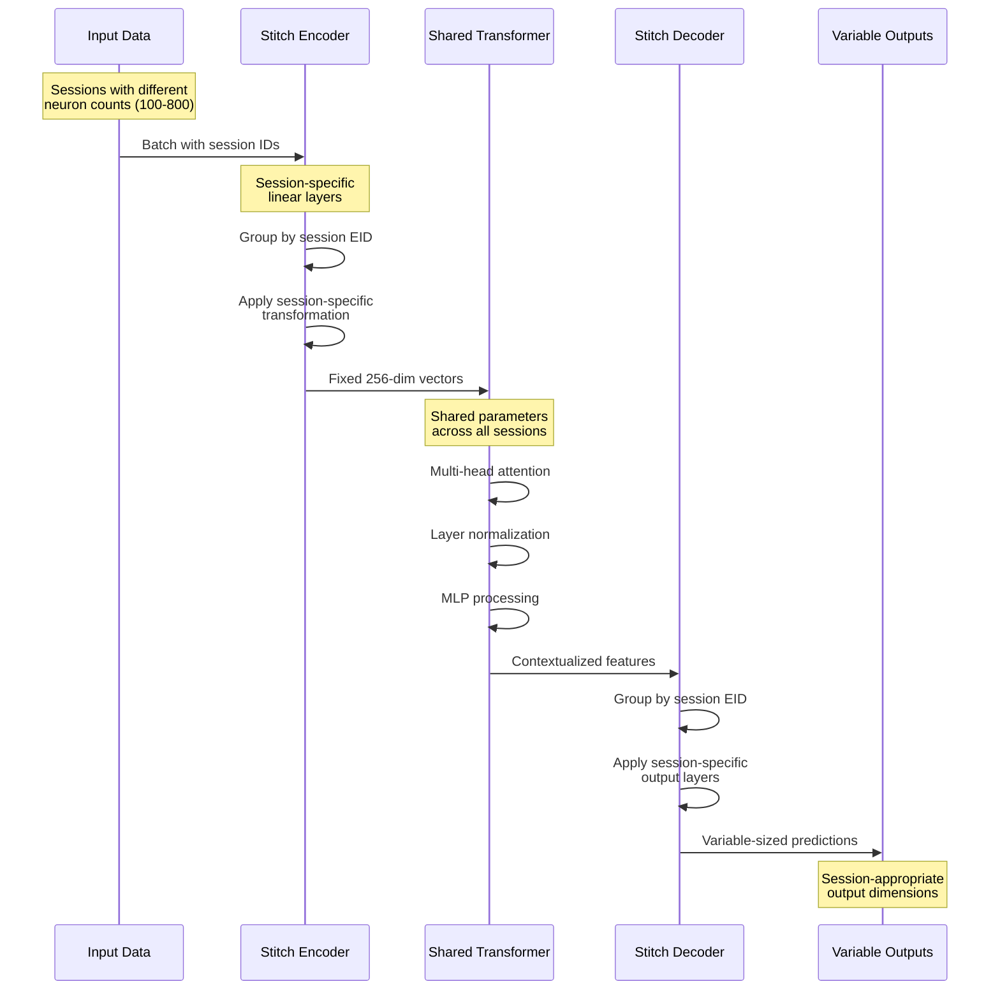

---

## Training Modes

### Three Primary Training Configurations

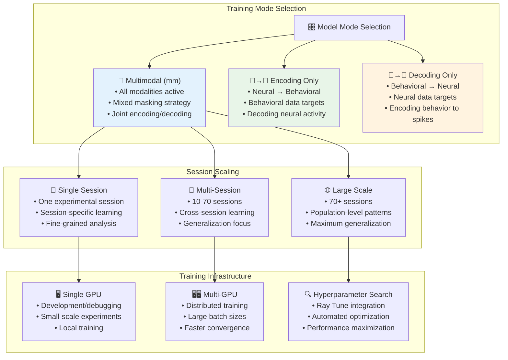

### Evaluation Framework

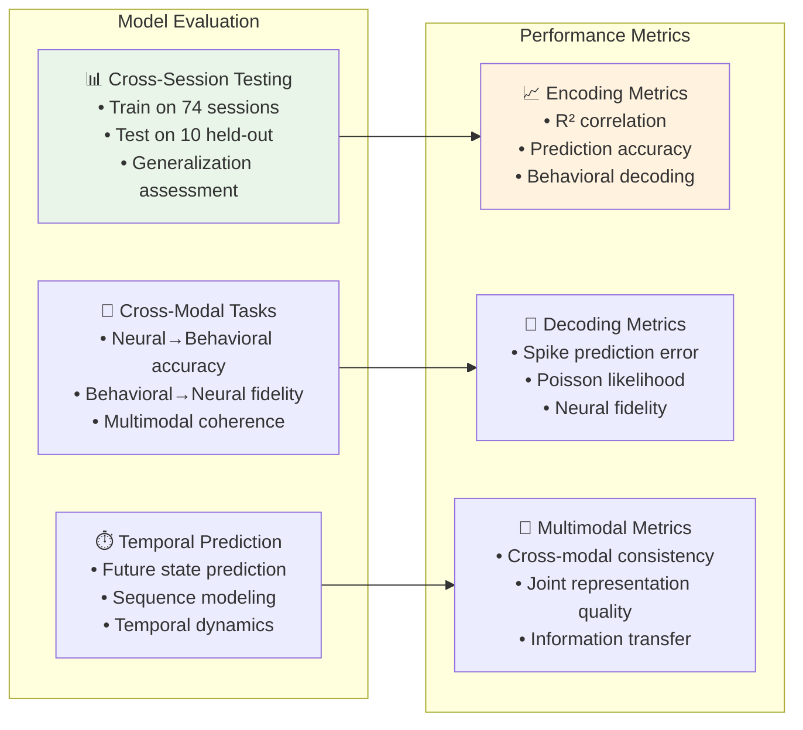

---

## Data Specifications

### Data Dimensions and Formats

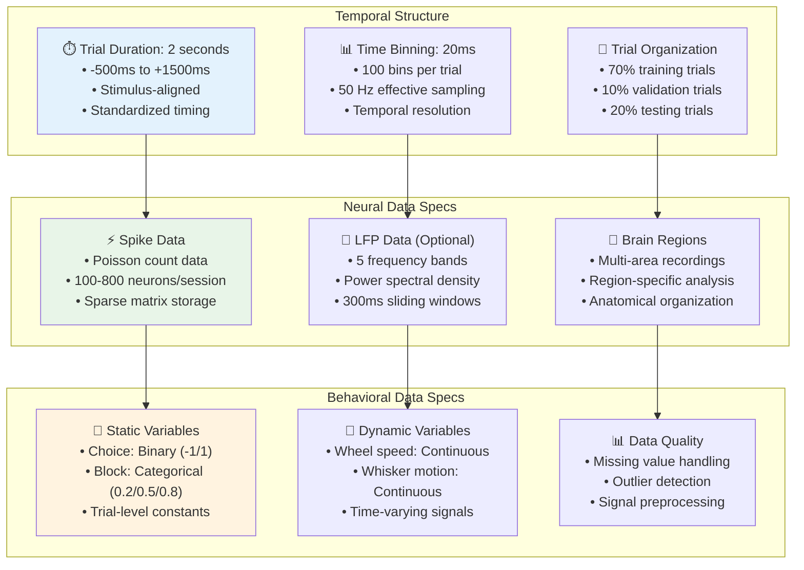

### Memory and Storage Optimization

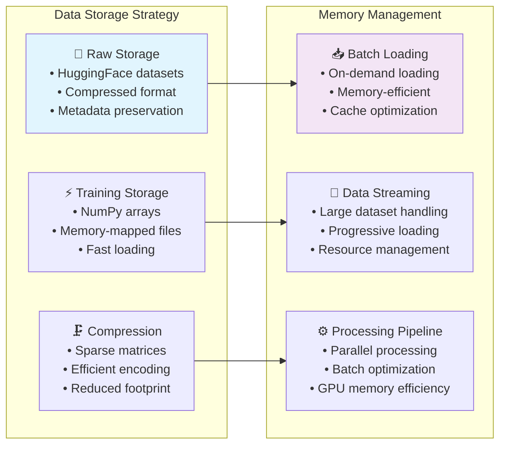

---

## Key Innovations

### Revolutionary Contributions

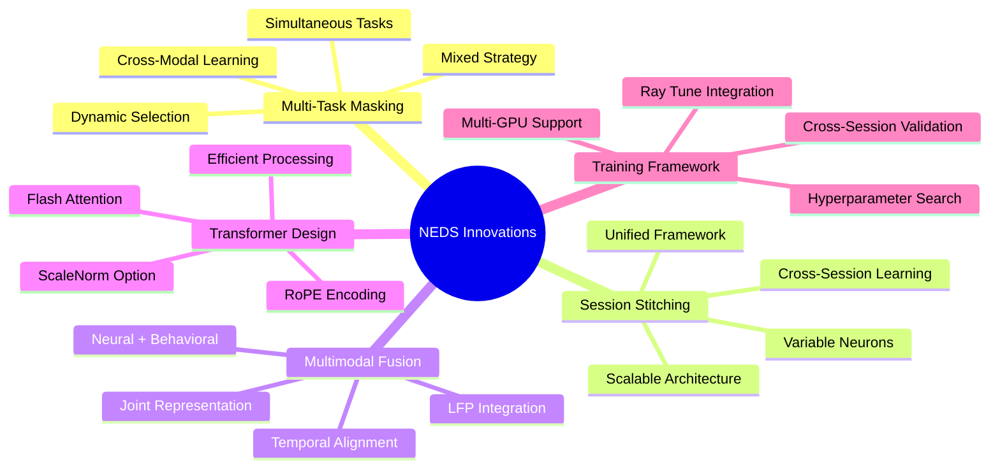

### Technical Breakthroughs

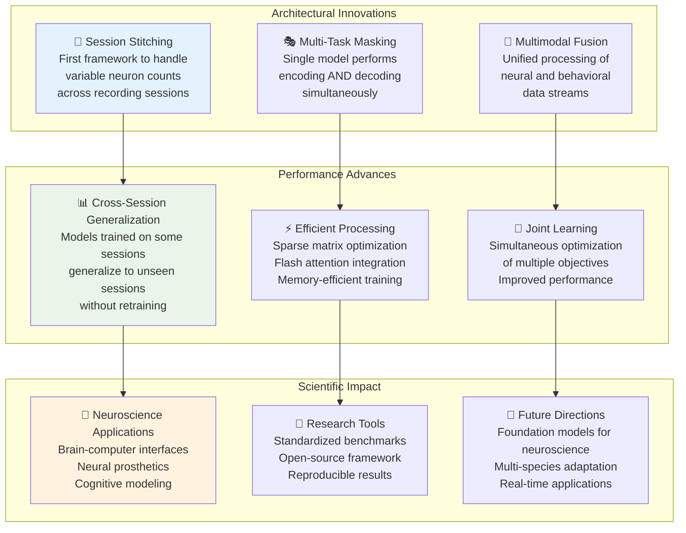

---

## Summary

NEDS represents a paradigm shift in computational neuroscience by:

1. **🔄 Unifying Encoding/Decoding**: Single model handles both neural→behavioral and behavioral→neural tasks
2. **🧩 Scalable Architecture**: Handles variable neuron counts across different recording sessions  
3. **🎭 Intelligent Masking**: Dynamic masking strategy enables multi-task learning
4. **⚡ Efficient Processing**: Optimized for large-scale neural data with sparse representations
5. **🌐 Cross-Session Learning**: Generalizes across different experimental sessions and subjects

This comprehensive framework enables unprecedented analysis of neural-behavioral relationships at scale, opening new possibilities for brain-computer interfaces, neural prosthetics, and fundamental neuroscience research.

---

*For detailed implementation examples and usage instructions, see the main [README.md](README.md)*
