# NEDS Data Flow Documentation

This document provides detailed data flow diagrams and specifications for the NEDS project.

## Complete Data Flow Pipeline

```mermaid
flowchart TD
    subgraph "🗄️ Data Sources"
        IBL[(IBL Database<br/>84 experimental sessions)]
        ONE[ONE API Client<br/>Data access interface]
        EIDs[Session IDs<br/>train_eids.txt<br/>test_eids.txt]
    end
    
    subgraph "📥 Data Acquisition"
        Download[prepare_data.py<br/>Download & preprocess]
        
        subgraph "Raw Data Types"
            Spikes[🧠 Spike Trains<br/>Action potentials<br/>Variable neurons/session]
            LFP[🌊 LFP Signals<br/>Local field potentials<br/>2500 Hz sampling]
            Behavior[🎯 Behavioral Data<br/>Wheel, whisker, choice, block]
            Meta[📊 Metadata<br/>Brain regions, depths, quality]
        end
    end
    
    subgraph "⚙️ Preprocessing Pipeline"
        
        subgraph "Neural Processing"
            BinSpikes[Spike Binning<br/>20ms time bins<br/>Poisson counts]
            FilterNeurons[Neuron Filtering<br/>Remove low FR<br/>Quality control]
            ProcessLFP[LFP Processing<br/>Filter → Reference<br/>→ Spectral features]
        end
        
        subgraph "Behavioral Processing"
            AlignBehavior[Behavioral Alignment<br/>Stimulus-locked<br/>Common time base]
            ExtractFeatures[Feature Extraction<br/>Wheel speed<br/>Whisker motion energy]
            CategorizeChoice[Choice Categorization<br/>Binary decisions<br/>Block contexts]
        end
        
        subgraph "Temporal Alignment"
            StimulusAlign[Stimulus Alignment<br/>-500ms to +1500ms<br/>2-second trials]
            QualityFilter[Quality Filtering<br/>Remove bad trials<br/>Missing data handling]
        end
    end
    
    subgraph "📦 Dataset Creation"
        HF_Format[HuggingFace Format<br/>Structured datasets<br/>Train/val/test splits]
        Sparse_Storage[Sparse Matrix Storage<br/>Memory efficient<br/>Fast loading]
        NPY_Convert[NumPy Conversion<br/>Training-ready format<br/>Batch processing]
    end
    
    subgraph "🎓 Model Training"
        DataLoader[Data Loading<br/>Batch creation<br/>Session grouping]
        MultiModal[NEDS Model<br/>Multimodal transformer<br/>Mixed masking]
        Training[Training Loop<br/>Cross-session learning<br/>Performance monitoring]
    end
    
    subgraph "📊 Evaluation"
        CrossSession[Cross-Session Testing<br/>Generalization assessment<br/>Held-out sessions]
        Metrics[Performance Metrics<br/>R², accuracy, likelihood<br/>Cross-modal coherence]
        Results[Results Analysis<br/>Statistical testing<br/>Scientific insights]
    end
    
    IBL --> ONE
    ONE --> EIDs
    EIDs --> Download
    
    Download --> Spikes
    Download --> LFP
    Download --> Behavior
    Download --> Meta
    
    Spikes --> BinSpikes
    LFP --> ProcessLFP
    Behavior --> AlignBehavior
    Meta --> FilterNeurons
    
    BinSpikes --> FilterNeurons
    ProcessLFP --> StimulusAlign
    AlignBehavior --> ExtractFeatures
    ExtractFeatures --> CategorizeChoice
    
    FilterNeurons --> StimulusAlign
    CategorizeChoice --> StimulusAlign
    StimulusAlign --> QualityFilter
    
    QualityFilter --> HF_Format
    HF_Format --> Sparse_Storage
    Sparse_Storage --> NPY_Convert
    
    NPY_Convert --> DataLoader
    DataLoader --> MultiModal
    MultiModal --> Training
    
    Training --> CrossSession
    CrossSession --> Metrics
    Metrics --> Results
    
    style IBL fill:#e1f5fe
    style Download fill:#f3e5f5
    style MultiModal fill:#e8f5e8
    style Results fill:#fff3e0
```



## Detailed Neural Data Processing


## Behavioral Data Processing Pipeline


## Model Input/Output Data Flow

```mermaid
flowchart LR
    subgraph "📥 Model Inputs"
        
        subgraph "Neural Inputs"
            SpikeInput[Spike Data<br/>Shape: (B, T, N)<br/>B=batch, T=time, N=neurons]
            LFPInput[LFP Features<br/>Shape: (B, T, F)<br/>F=frequency features]
        end
        
        subgraph "Behavioral Inputs"
            StaticInput[Static Behavior<br/>Shape: (B, S)<br/>S=static variables]
            DynamicInput[Dynamic Behavior<br/>Shape: (B, T, D)<br/>D=dynamic variables]
        end
        
        subgraph "Metadata Inputs"
            SessionID[Session IDs<br/>String identifiers<br/>Cross-session handling]
            Timestamps[Timestamps<br/>Temporal positions<br/>RoPE encoding]
            Masks[Attention Masks<br/>Valid data indicators<br/>Padding handling]
        end
    end
    
    subgraph "🔄 Model Processing"
        
        subgraph "Embedding Layer"
            TokenEmbed[Token Embeddings<br/>Modality-specific<br/>Linear projections]
            SessionEmbed[Session Embeddings<br/>Learned representations<br/>Cross-session transfer]
            PosEmbed[Position Embeddings<br/>Temporal encoding<br/>Sequence modeling]
        end
        
        subgraph "Masking Strategy"
            MaskSelect[Mask Selection<br/>Random strategy choice<br/>Task-specific patterns]
            MaskApply[Mask Application<br/>Token-level masking<br/>Prediction targets]
        end
        
        subgraph "Transformer Core"
            Attention[Multi-Head Attention<br/>Cross-modal fusion<br/>Temporal modeling]
            LayerNorm[Layer Normalization<br/>Training stability<br/>Gradient flow]
            MLP[MLP Processing<br/>Non-linear transforms<br/>Feature integration]
        end
    end
    
    subgraph "📤 Model Outputs"
        
        subgraph "Neural Outputs"
            SpikeOut[Spike Predictions<br/>Poisson parameters<br/>Count data modeling]
            LFPOut[LFP Predictions<br/>Spectral features<br/>Frequency domain]
        end
        
        subgraph "Behavioral Outputs"
            StaticOut[Static Predictions<br/>Classification logits<br/>Discrete choices]
            DynamicOut[Dynamic Predictions<br/>Regression outputs<br/>Continuous signals]
        end
        
        subgraph "Loss Computation"
            PoissonLoss[Poisson NLL Loss<br/>Neural spike modeling<br/>Count statistics]
            MSELoss[MSE Loss<br/>Continuous variables<br/>Regression tasks]
            CELoss[CrossEntropy Loss<br/>Categorical variables<br/>Classification tasks]
        end
    end
    
    SpikeInput --> TokenEmbed
    LFPInput --> TokenEmbed
    StaticInput --> SessionEmbed
    DynamicInput --> SessionEmbed
    
    SessionID --> SessionEmbed
    Timestamps --> PosEmbed
    Masks --> MaskSelect
    
    TokenEmbed --> MaskApply
    SessionEmbed --> MaskApply
    PosEmbed --> Attention
    MaskSelect --> Attention
    
    MaskApply --> Attention
    Attention --> LayerNorm
    LayerNorm --> MLP
    
    MLP --> SpikeOut
    MLP --> LFPOut
    MLP --> StaticOut
    MLP --> DynamicOut
    
    SpikeOut --> PoissonLoss
    LFPOut --> MSELoss
    StaticOut --> CELoss
    DynamicOut --> MSELoss
    
    style SpikeInput fill:#ffebee
    style TokenEmbed fill:#e8f5e8
    style Attention fill:#e3f2fd
    style SpikeOut fill:#fff3e0
```

## Session Stitching Data Flow

```mermaid
flowchart TD
    subgraph "🧩 Session Stitching Architecture"
        
        subgraph "Variable Input Dimensions"
            Sess1[Session A<br/>150 neurons<br/>250 trials]
            Sess2[Session B<br/>300 neurons<br/>180 trials]
            Sess3[Session C<br/>500 neurons<br/>320 trials]
            Sess4[Session D<br/>120 neurons<br/>290 trials]
        end
        
        subgraph "Stitch Encoder"
            Dict1[Linear Layer A<br/>150 → 256<br/>Session-specific weights]
            Dict2[Linear Layer B<br/>300 → 256<br/>Session-specific weights]
            Dict3[Linear Layer C<br/>500 → 256<br/>Session-specific weights]
            Dict4[Linear Layer D<br/>120 → 256<br/>Session-specific weights]
        end
        
        subgraph "Shared Processing"
            Unified[Unified Representation<br/>256 dimensions<br/>All sessions]
            Transformer[Shared Transformer<br/>Cross-session learning<br/>Common parameters]
        end
        
        subgraph "Stitch Decoder"
            OutDict1[Output Layer A<br/>256 → 150<br/>Session-specific predictions]
            OutDict2[Output Layer B<br/>256 → 300<br/>Session-specific predictions]
            OutDict3[Output Layer C<br/>256 → 500<br/>Session-specific predictions]
            OutDict4[Output Layer D<br/>256 → 120<br/>Session-specific predictions]
        end
        
        subgraph "Variable Output Dimensions"
            Out1[Session A Output<br/>150 neurons<br/>Predicted spikes]
            Out2[Session B Output<br/>300 neurons<br/>Predicted spikes]
            Out3[Session C Output<br/>500 neurons<br/>Predicted spikes]
            Out4[Session D Output<br/>120 neurons<br/>Predicted spikes]
        end
    end
    
    Sess1 --> Dict1
    Sess2 --> Dict2
    Sess3 --> Dict3
    Sess4 --> Dict4
    
    Dict1 --> Unified
    Dict2 --> Unified
    Dict3 --> Unified
    Dict4 --> Unified
    
    Unified --> Transformer
    Transformer --> OutDict1
    Transformer --> OutDict2
    Transformer --> OutDict3
    Transformer --> OutDict4
    
    OutDict1 --> Out1
    OutDict2 --> Out2
    OutDict3 --> Out3
    OutDict4 --> Out4
    
    style Sess1 fill:#ffebee
    style Dict1 fill:#e8f5e8
    style Unified fill:#e3f2fd
    style OutDict1 fill:#fff3e0
    style Out1 fill:#f1f8e9
```



## Training Data Flow

```mermaid
sequenceDiagram
    participant DataLoader as 📥 Data Loader
    participant Embedder as 🔗 Embedder
    participant Masker as 🎭 Masker
    participant Transformer as 🔄 Transformer
    participant Decoder as 📤 Decoder
    participant Loss as 📊 Loss Computer
    participant Optimizer as ⚙️ Optimizer
    
    Note over DataLoader: Load batch of trials<br/>Multiple sessions
    
    DataLoader->>Embedder: Raw multimodal data
    Note over Embedder: Session-specific embedding<br/>Modality embeddings<br/>Position embeddings
    
    Embedder->>Masker: Embedded tokens
    Note over Masker: Select masking strategy<br/>Apply masks<br/>Generate targets
    
    Masker->>Transformer: Masked inputs
    Note over Transformer: Multi-head attention<br/>Layer normalization<br/>MLP processing
    
    Transformer->>Decoder: Contextualized features
    Note over Decoder: Session-specific outputs<br/>Modality-specific heads<br/>Prediction generation
    
    Decoder->>Loss: Predictions + targets
    Note over Loss: Modality-specific losses<br/>Poisson NLL for spikes<br/>MSE/CE for behavior
    
    Loss->>Optimizer: Combined loss
    Note over Optimizer: Gradient computation<br/>Parameter updates<br/>Learning rate scheduling
    
    Optimizer-->>DataLoader: Next batch
```



## Evaluation Pipeline


## Memory and Storage Optimization

```mermaid
flowchart LR
    subgraph "💾 Data Storage Strategy"
        
        subgraph "Raw Data Storage"
            HF_Datasets[HuggingFace Datasets<br/>Structured format<br/>Metadata preservation]
            Compression[Data Compression<br/>Sparse matrices<br/>Efficient encoding]
            Caching[Smart Caching<br/>Frequently accessed<br/>Memory mapping]
        end
        
        subgraph "Training Storage"
            NPY_Arrays[NumPy Arrays<br/>Fast loading<br/>Memory-mapped files]
            Batch_Cache[Batch Caching<br/>Pre-computed batches<br/>Reduced I/O overhead]
            GPU_Memory[GPU Memory<br/>Efficient transfers<br/>Pipeline overlap]
        end
        
        subgraph "Memory Management"
            Lazy_Loading[Lazy Loading<br/>On-demand access<br/>Memory conservation]
            Garbage_Collection[Garbage Collection<br/>Automatic cleanup<br/>Memory leaks prevention]
            Buffer_Pool[Buffer Pooling<br/>Reusable memory<br/>Allocation efficiency]
        end
    end
    
    subgraph "⚡ Performance Optimization"
        
        subgraph "Data Pipeline"
            Parallel_Load[Parallel Loading<br/>Multi-worker<br/>Concurrent processing]
            Prefetch[Data Prefetching<br/>Background loading<br/>Hide I/O latency]
            Pin_Memory[Pinned Memory<br/>Faster GPU transfers<br/>Reduced copy overhead]
        end
        
        subgraph "Model Optimization"
            Flash_Attention[Flash Attention<br/>Memory-efficient<br/>Faster computation]
            Gradient_Checkpoint[Gradient Checkpointing<br/>Memory vs compute<br/>Large model training]
            Mixed_Precision[Mixed Precision<br/>FP16 training<br/>Speed improvement]
        end
        
        subgraph "Scaling"
            Model_Parallel[Model Parallelism<br/>Large model support<br/>Multi-GPU distribution]
            Data_Parallel[Data Parallelism<br/>Batch distribution<br/>Synchronized training]
            Pipeline_Parallel[Pipeline Parallelism<br/>Layer distribution<br/>Sequential processing]
        end
    end
    
    HF_Datasets --> NPY_Arrays
    Compression --> Batch_Cache
    Caching --> GPU_Memory
    
    NPY_Arrays --> Lazy_Loading
    Batch_Cache --> Garbage_Collection
    GPU_Memory --> Buffer_Pool
    
    Lazy_Loading --> Parallel_Load
    Garbage_Collection --> Prefetch
    Buffer_Pool --> Pin_Memory
    
    Parallel_Load --> Flash_Attention
    Prefetch --> Gradient_Checkpoint
    Pin_Memory --> Mixed_Precision
    
    Flash_Attention --> Model_Parallel
    Gradient_Checkpoint --> Data_Parallel
    Mixed_Precision --> Pipeline_Parallel
    
    style HF_Datasets fill:#e1f5fe
    style NPY_Arrays fill:#f3e5f5
    style Lazy_Loading fill:#e8f5e8
    style Parallel_Load fill:#fff3e0
    style Flash_Attention fill:#f1f8e9
    style Model_Parallel fill:#fce4ec
```



This comprehensive data flow documentation provides detailed insights into every aspect of the NEDS data processing pipeline, from raw data acquisition through model training and evaluation. Each diagram illustrates specific components and their interactions within the larger system architecture.
